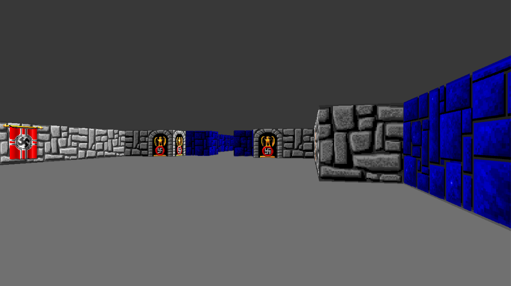

# Wolfenstein3D using C++ and SDL2

This application allows users to explore all the maps from the 1992 classic Wolfenstein.

To render the maps, I employ raycasting (https://lodev.org/cgtutor/raycasting.html), a rendering technique that simulates 3D perspectives on a 2D map. The rendering process operates in a separate thread, resulting in a multi-threaded architecture with a primary thread and a dedicated rendering thread. The rendering thread leverages a concurrent queue to efficiently and safely manage operations across multiple threads or processes. This queue processes commands to render various objects such as lines and images. Commands are sent from the main thread to the rendering thread via the concurrent queue, where they are processed and executed.

Controls:
- W and D: move 
- A and D: turn
- ESC: exit the application

  

